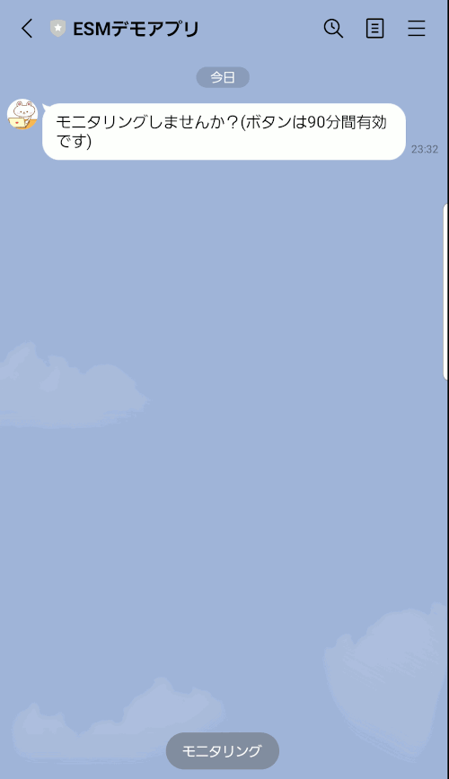
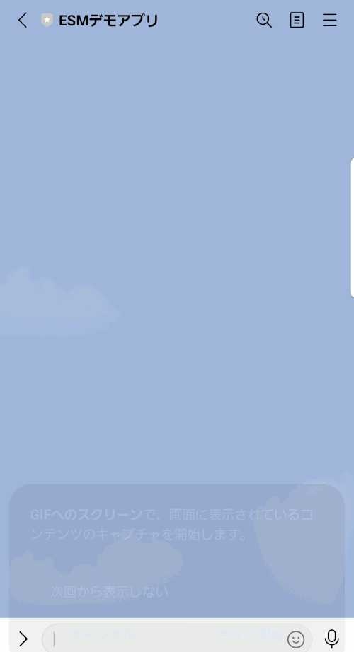

# LINE Messaging API (LINE bot)で経験サンプリング法 (ESM)アプリを作ってみた
 
# 仕様
## ESM機能
9:00~21:00に1日平均3回，ランダムなタイミングで通知が送信され，通知送信から90分以内にボタンを押せば，回答を開始できます。  
リッカート式項目および，多岐選択式項目を使用可能です。  
通知から90分経過後は，ボタンは無効になります。  
個々の回答の値は，データベースに格納されます (下記画像では，HeidiSQLを使用しています)。  

## ID登録機能
任意の参加者IDを登録すれば，ESMの回答と紐づけられます (上記データベース画像のparticipant_idにあたります)。  
 
## テスト起動機能
通常，通知はランダムなタイミングで送信されますが，「テスト起動」と入力すれば，動作テストなどのために強制的にESMを開始することもできます。
# 参考文献
## 質問項目および選択肢作成の参考にした文献
Verhagen, S. J. W., Hasmi, L., Drukker, M., van Os, J., & Delespaul, P. A. E. G. (2016). Use of the experience sampling method in the context of clinical trials. *Evidence-Based Mental Health*, *19*(3), 86–89. https://doi.org/10.1136/ebmental-2016-102418
